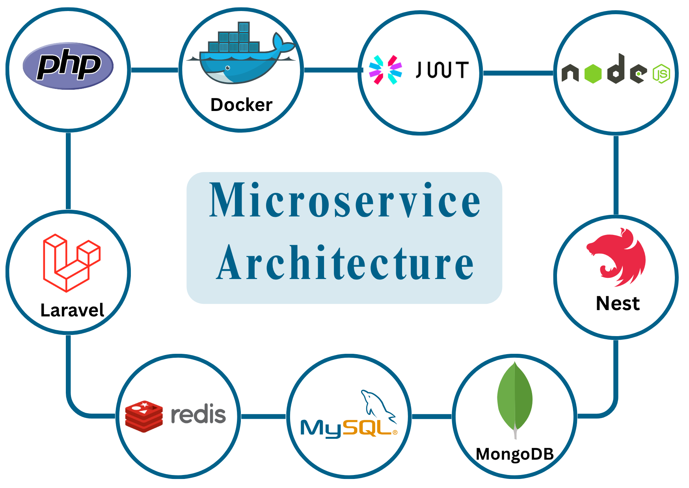

# Microservice Demo Architecture



A containerized, event-driven microservices architecture that decouples user, product, order, and notification domains. Built with Laravel and NestJS, designed for scalability, modularity, and ease of testing.

---

##  Project Overview

This project demonstrates a modular microservices system where each service handles a distinct business domain:

- **User Service** (Laravel)
- **Product Service** (NestJS)
- **Order Service** (Laravel)
- **Notification Service** (NestJS)

Services communicate asynchronously using Redis Pub/Sub. The architecture is fully containerized via Docker and optimized for CI/CD and testing environments.

---

## project-structure

```bash

├── micro-services/                    # Contains all individual microservice folders.
│   ├── laravel-user-service/          # Laravel service responsible for user management and authentication.
│   ├── laravel-order-service/         # Laravel service handling user orders and order processing.
│   ├── nest-product-service/          # NestJS service for product-related operations.
│   └── nest-notification-service/     # NestJS service for managing notifications (emails, WebSocket, etc).
│
├── shared/                            # Common/shared services like Redis
│   └── redis-stack.yml                # Docker Compose setup for Redis cache service.
 


```


---
## Business Logic by Service

### 1. **Laravel User Service**
- Handles user registration and login
- Manages JWT access and refresh tokens
- Publishes `user.registered` event to Redis

### 2. **Nest Product Service**
- Provides product details
- Manages product wishlists
- Publishes `product.updated` event to Redis

### 3. **Laravel Order Service**
- Manages user orders
- Publishes `order.created` event to Redis

### 4. **Nest Notification Service**
- Subscribes to:
  - `user.registered`
  - `product.updated`
  - `order.created`
- Sends notifications or logs events accordingly

---

## Key Features

- **Microservices Architecture**
  Each domain is independently deployed, maintained, and scaled.

- **Event-Driven Communication**
  Uses Redis Pub/Sub channels to propagate events between services.

- **JWT Authentication**
  Stateless authentication with access and refresh token handling.

- **Test-Ready Design**
  DTOs, service interfaces, and stubs support unit isolation and service mocking.

- **Dockerized Environment**
  Entire system is containerized with `docker-compose` for local and CI use.

- **Modular & Scalable**
  Add new services with minimal impact on existing functionality.

- **Isolated Testing Architecture**
  Database containers and service mocks allow robust and isolated test runs.

---


## Run Project Steps

Follow these steps to bring up microservices. Ensure you are in the root directory of your project (where your docker and micro-services folders reside) when executing the cd commands for each step.


**1. Create the External Network**

- All your services rely on a shared external network for communication. You only need to create this network once.

```bash
docker network create app-network
```

**2. Run Redis Service**

- Redis is a shared dependency. Start its stack first.

```bash
cd micro-services/shared

docker compose -f redis-stack.yml --env-file docker.env up -d --build

cd ../..   # Return to project root

```

**3. Run User Service**

- Start the Laravel User Service and its dedicated MySQL database.

```bash
cd micro-services/laravel-user-service

docker compose -f user-stack.yml --env-file docker.env up -d --build

cd ../..   # Return to project root
```

**4. Run Product Service**
- Start the NestJS Product Service and its dedicated MySQL database.

```bash
cd micro-services/nestjs-product-service

docker compose -f product-stack.yml --env-file docker.env up -d --build

cd ../..   # Return to project root

```


**5. Run Order Service**
- Start the Laravel Order Service and its dedicated MySQL database.

```bash
cd micro-services/laravel-order-service

docker compose -f order-stack.yml --env-file docker.env up -d --build

cd ../..   # Return to project root
```


**6. Run Notification Service**
- Start the NestJS Notification Service and its dedicated MongoDB database.

```bash
cd micro-services/nestjs-notification-service

docker compose -f notification-stack.yml --env-file docker.env up -d --build

cd ../..   # Return to project root

```


---
## Tools & Technologies

- **Laravel**
- **NestJS**
- **MySQL** – Relational DB for User, Product, and Order services
- **MongoDB** – NoSQL DB for Notification service
- **Redis Pub/Sub** – Event-driven service communication
- **JWT**
- **Docker & Docker Compose**
- **PHPUnit** – Unit testing for Laravel
- **Jest** – Unit testing for NestJS services
- **Postman** – API exploration and testing

