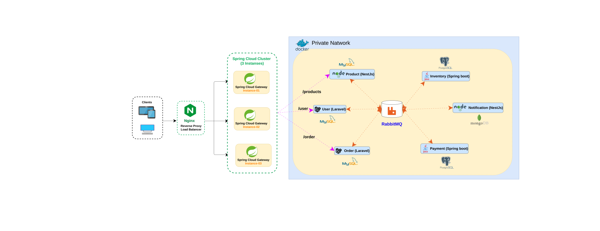

# Microservice Demo Architecture


A containerized, event-driven microservices architecture that decouples user, product, order, and notification domains. Built with Laravel and NestJS,
designed for scalability, modularity, and ease of testing.


---


Table of contents
=================

* [Project Overview](#project-overview)
* [Project Structure](#project-structure)
* [Architecture Layers](#architecture-layers)
* [Business Logic by Service](#business-logic-by-service)
* [Key Features](#key-features)
* [Testing Individual Services](#testing-individual-services)
* [Run Project Steps](#run-project-steps)
* [Tools & Technologies](#tools--technologies)
* [License](#license)


---

##  Project Overview

This project demonstrates a modular microservices system where each service handles a distinct business domain:

- **Nginx** — Infrastructure-layer load balancer / reverse proxy (edge)
- **API Gateway** (Spring Boot / Spring Cloud Gateway) — Application-layer gateway (JWT auth, dynamic routing, rate limiting, circuit breaking)
- **User Service** (Laravel)
- **Product Service** (NestJS)
- **Order Service** (Laravel)
- **Payment Service** (Spring Boot)
- **Inventory Service** (Spring Boot)
- **Notification Service** (NestJS)

Services communicate asynchronously using RabbitMQ. All external client traffic enters through Nginx, which load balances across API Gateway instances; the gateway then handles authentication and routes requests to the appropriate downstream service. The architecture is fully containerized via Docker and optimized for CI/CD and testing environments.

---

## Project Structure

```bash
├── run-all.sh                          # One-command script to bring up every service in order.
├── stop-all.sh                         # One-command script to tear down every service.
│
├── nginx/                              # Infrastructure-layer load balancer / reverse proxy.
│   ├── nginx.conf                      # Nginx configuration (upstreams, TLS, routing to API Gateway).
│   └── nginx-stack.yml                 # Docker Compose setup for Nginx.
│
├── micro-services/                    # Contains all individual microservice folders.
│   ├── springboot-api-gateway/        # Spring Cloud Gateway: JWT auth, dynamic routing, rate limiting, circuit breaking.
│   │   └── gateway-stack.yml          # Docker Compose setup running 3 named gateway instances (api-gateway-1/2/3).
│   ├── laravel-user-service/          # Laravel service responsible for user management and authentication.
│   ├── laravel-order-service/         # Laravel service handling user orders and order processing.
│   ├── nest-product-service/          # NestJS service for product-related operations.
│   ├── nest-notification-service/     # NestJS service for managing notifications (emails, WebSocket, etc).
│   ├── springboot-payment-service/    # Spring Boot service handling payment processing.
│   ├── springboot-inventory-service/  # Owns stock and inventory management.
│   └── shared/                        # Common/shared services like Redis and RabbitMQ
│       ├── redis-stack.yml            # Docker Compose setup for Redis cache service.
│       └── rabbitmq-stack.yml         # Docker Compose setup for RabbitMQ broker service.
 


```

--- 

## Prerequisites
Before you begin, ensure you have the following installed on your system:
- Docker Desktop (includes Docker Engine and Docker Compose) or Docker Engine and Docker Compose standalone.

---

## Architecture Layers

Traffic flows through two distinct layers before reaching any business service:

```
Internet
   │
   ▼
Nginx (Infrastructure Layer — Load Balancer / Reverse Proxy)
   - TLS termination
   - Distributes traffic across API Gateway instances
   - Basic/passive health checks
   - Edge-level throttling
   │
   ▼
Spring Boot API Gateway — 3 instances (api-gateway-1, api-gateway-2, api-gateway-3)
   - JWT authentication & claims validation
   - Dynamic, service-aware routing
   - Per-route rate limiting
   - Circuit breaking (Resilience4j)
   │
   ├──► Laravel User Service
   ├──► NestJS Product Service
   ├──► Laravel Order Service
   ├──► Spring Boot Payment Service
   ├──► Spring Boot Inventory Service
   └──► services publish events → RabbitMQ → Notification Service consumes
```

**Why both?** Nginx and the Spring Boot API Gateway serve different concerns, not competing ones. Nginx handles fast, infrastructure-level concerns (TLS, load distribution, edge protection), while the API Gateway handles business-aware concerns (auth, routing logic, rate limiting per route/user, circuit breaking).

**Why 3 named instances instead of `--scale`?** Nginx resolves upstream hostnames once at startup. Docker Compose's `--scale` flag creates replicas that share one service name, which Nginx can't discover automatically. Running 3 explicitly named services (`api-gateway-1`, `api-gateway-2`, `api-gateway-3`) lets Nginx list each one directly in its upstream block for reliable load balancing.

---
## Business Logic by Service

### 1. **Spring Boot API Gateway** (`springboot-api-gateway`)
- Runs as 3 load-balanced instances (`api-gateway-1`, `api-gateway-2`, `api-gateway-3`) behind Nginx
- Single entry point for all client requests (sits behind Nginx)
- Validates JWT access tokens on incoming requests
- Routes requests dynamically to the correct downstream service
- Applies per-route rate limiting
- Applies circuit breaking to protect against cascading failures from downstream services

### 2. **Laravel User Service**
- Handles user registration and login
- Manages JWT access and refresh tokens
- Publishes `user.registered` event to RabbitMQ

### 3. **Nest Product Service**
- Provides product details
- Manages product wishlists
- Publishes `product.updated` event to RabbitMQ

### 4. **Laravel Order Service**
- Manages user orders
- Publishes `order.created` event to RabbitMQ

### 5. **Spring Boot Payment Service**
- Processes order payments
- Publishes `payment.successful` and `payment.failed` events to RabbitMQ

### 6. **Spring Boot Inventory Service**
- Owns stock and inventory management
- Listens to order and payment events to reserve or deduct stock

### 7. **Nest Notification Service**
- Subscribes to:
  - `user.registered`
  - `product.updated`
  - `order.created`
  - `payment.successful`
  - `payment.failed`
- Sends notifications or logs events accordingly

---

## Key Features

- **Microservices Architecture**
  Each domain is independently deployed, maintained, and scaled.

- **Layered Gateway Architecture**
  Nginx (infrastructure load balancing) sits in front of 3 Spring Boot API Gateway instances (application-aware routing, auth, rate limiting, circuit breaking).

- **Event-Driven Communication**
  Uses RabbitMQ to propagate events between services.

- **JWT Authentication**
  Stateless authentication with access and refresh token handling, validated centrally at the API Gateway.

- **Test-Ready Design**
  DTOs, service interfaces, and stubs support unit isolation and service mocking.

- **Dockerized Environment**
  Entire system is containerized with `docker-compose` for local and CI use.

- **Modular & Scalable**
  Add new services with minimal impact on existing functionality.

- **Isolated Testing Architecture**
  Database containers and service mocks allow robust and isolated test runs.

---


# Testing Individual Services

This project promotes **isolated, robust, and layered testing** across services, distinguishing between **unit** and **feature (integration)** testing.

- NestJS Services (Product, Notification): Tests are written using Jest. Navigate to the respective service directory (```micro-services/nestjs-product-service``` or ```micro-services/nestjs-notification-service```) and run ```npm run test``` to execute unit tests. End-to-end tests can be run with ```npm run test:e2e```


- Laravel Services (User, Order): Tests are written using PHPUnit. Navigate to the respective service directory (```micro-services/laravel-user-service``` or ```micro-services/laravel-order-service```) and run ```./vendor/bin/phpunit``` or ```docker compose exec <service-name> php artisan test``` to execute tests.


- Spring Boot Services (Payment, Inventory, API Gateway): Tests are written using JUnit. Navigate to the respective service directory (e.g. ```micro-services/springboot-payment-service``` or ```micro-services/springboot-api-gateway```) and run ```./mvnw test``` or ```./gradlew test``` depending on your build tool.


## Run Project Steps

There are two ways to bring the project up: the **one-command script** (recommended for everyday use) or the **manual step-by-step** commands (useful for debugging a specific service or understanding the startup order).

### Option A — One Command (recommended)

From the project root:

```bash
chmod +x run-all.sh   # only needed once
./run-all.sh
```

This runs every step below in order — network creation, shared services, all business services, the 3 API Gateway instances, then Nginx — and stops immediately if any step fails, so you never end up with a half-started stack.

Once it finishes, the whole system is reachable at **http://localhost** (Nginx entry point).

To tear everything back down with one command:

```bash
chmod +x stop-all.sh   # only needed once
./stop-all.sh
```

### Option B — Manual, Step by Step

Ensure you are in the root directory of your project (where your `nginx/` and `micro-services/` folders reside) when executing the `cd` commands for each step.


**1. Create the External Network**

- All your services rely on a shared external network for communication. You only need to create this network once.
```bash
docker network create app-network
```

**2. Run Shared Services**

- Redis and RabbitMQ are shared dependencies. Start their stacks first.
```bash
cd micro-services/shared
 
docker compose -f redis-stack.yml --env-file docker.env up -d --build
docker compose -f rabbitmq-stack.yml --env-file docker.env up -d --build
 
cd ../..   # Return to project root
 
```

**3. Run User Service**

- Start the Laravel User Service and its dedicated MySQL database.
```bash
cd micro-services/laravel-user-service
 
docker compose -f user-stack.yml --env-file docker.env up -d --build
 
cd ../..   # Return to project root
```

**4. Run Product Service**
- Start the NestJS Product Service and its dedicated MySQL database.
```bash
cd micro-services/nestjs-product-service
 
docker compose -f product-stack.yml --env-file docker.env up -d --build
 
cd ../..   # Return to project root
 
```


**5. Run Order Service**
- Start the Laravel Order Service and its dedicated MySQL database.
```bash
cd micro-services/laravel-order-service
 
docker compose -f order-stack.yml --env-file docker.env up -d --build
 
cd ../..   # Return to project root
```


**6. Run Payment Service**
- Start the Spring Boot Payment Service and its dedicated database.
```bash
cd micro-services/springboot-payment-service
 
docker compose -f payment-stack.yml --env-file .env up -d --build
 
cd ../..   # Return to project root
```


**7. Run Inventory Service**
- Start the Spring Boot Inventory Service and its dedicated database.
```bash
cd micro-services/springboot-inventory-service
 
docker compose -f inventory-stack.yml --env-file .env up -d --build
 
cd ../..   # Return to project root
```


**8. Run Notification Service**
- Start the NestJS Notification Service and its dedicated MongoDB database.
```bash
cd micro-services/nestjs-notification-service
 
docker compose -f notification-stack.yml --env-file docker.env up -d --build
 
cd ../..   # Return to project root
 
```


**9. Run the Spring Boot API Gateway (3 instances)**

- Start the API Gateway layer. `gateway-stack.yml` defines **3 explicitly named instances** — `api-gateway-1`, `api-gateway-2`, `api-gateway-3` — all built from the same image, so Nginx can load balance across them by name. Start this after the downstream services it routes to are up.
```bash
cd micro-services/springboot-api-gateway
 
docker compose -f gateway-stack.yml --env-file docker.env up -d --build
 
cd ../..   # Return to project root
```

- This brings up all 3 instances at once (no `--scale` flag needed — they're already defined as separate services). Optional direct-access ports for debugging (bypassing Nginx):
  - `api-gateway-1` → http://localhost:8081
  - `api-gateway-2` → http://localhost:8082
  - `api-gateway-3` → http://localhost:8083
    **10. Run Nginx (Infrastructure Load Balancer)**

- Nginx sits at the very edge, terminates TLS, and load balances traffic across the 3 running API Gateway instances. Start this last, once all 3 gateway instances are up.
```bash
cd nginx
 
docker compose -f nginx-stack.yml up -d --build
 
cd ..   # Return to project root
```

- Once running, all client traffic should be sent to Nginx (e.g. `https://api.yourdomain.com` or `http://localhost` locally), which load balances across `api-gateway-1/2/3`, which in turn route to the correct backend service.
---
## Tools & Technologies

- **Nginx** – Infrastructure-layer load balancer / reverse proxy / TLS termination
- **Spring Cloud Gateway** – Application-layer API Gateway (JWT auth, dynamic routing, rate limiting, circuit breaking) — 3 load-balanced instances
- **Laravel**
- **NestJS**
- **Spring Boot**
- **MySQL** – Relational DB for User, Product, Order, and Payment services
- **MongoDB** – NoSQL DB for Notification service
- **RabbitMQ** – Event-driven service communication
- **JWT**
- **Docker & Docker Compose**
- **PHPUnit** – Unit testing for Laravel
- **Jest** – Unit testing for NestJS services
- **JUnit** – Unit testing for Spring Boot services (Payment, Inventory, API Gateway)
- **Postman** – API exploration and testing
---

## License

This project is licensed under the [MIT License](./LICENSE).